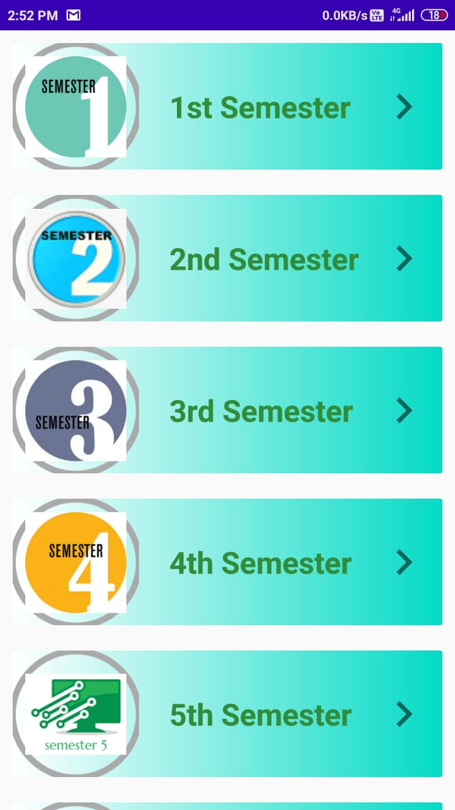
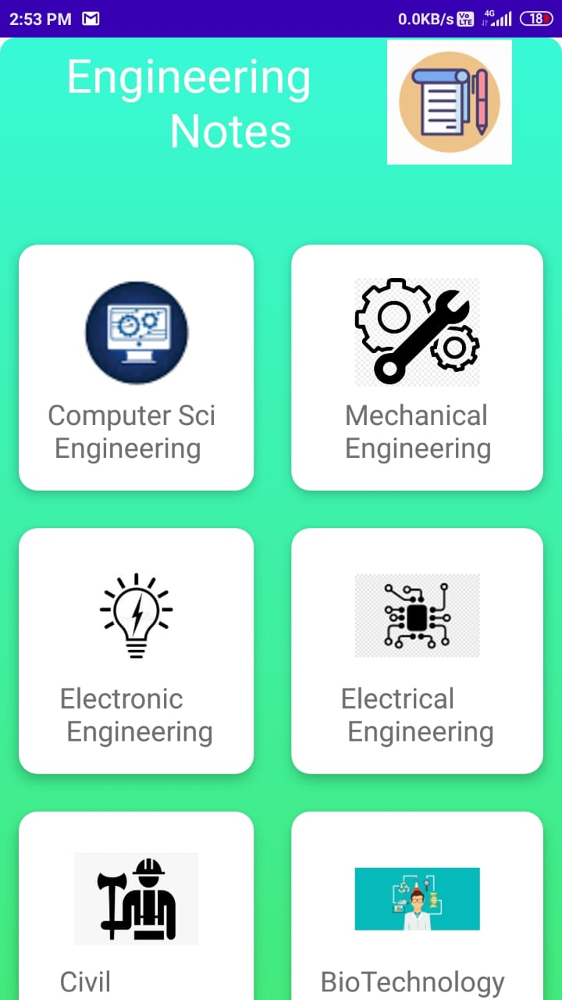
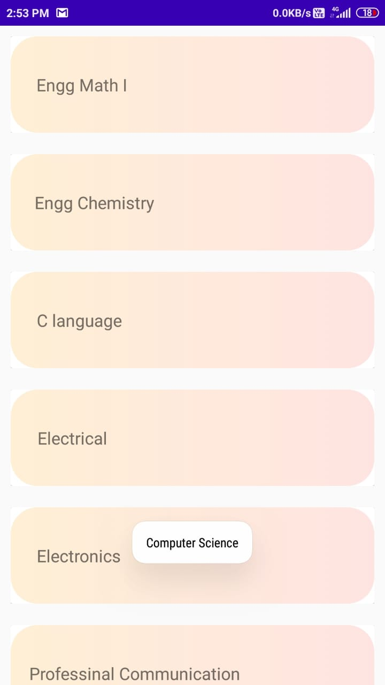
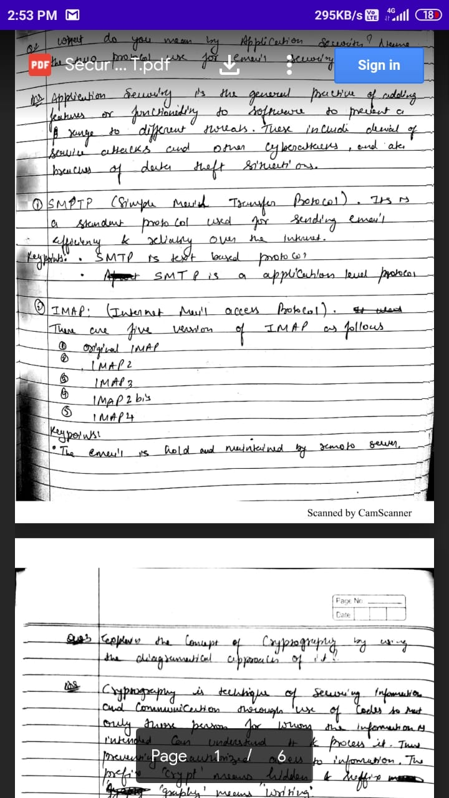

# **Notes Sharing | Android**
---

Welcome to Notes sharing open-source Android app!

### Requirements

- Android OS version 5.0 or newer

### Screenshots

### Benefits
- Get the notes in hand
- Easy to use
- Free
- Money Saving
- Time Saving

### Installing the App on your Android Device

Installation of FetLife App is a bit different than for Apps from the Google Play store, but it is still pretty straightforward, Android OS will guide you through the whole process.

Just download our latest version [NotesSharing.apk](https://github.com/fetlife/android/releases/download/v3.0.3/fetlife-3.0.3.apk) and follow the on-screen prompts on your device.

### Want to Contribute?

We appreciate any feedback or comments you have about our Android App. If you feel like going even further and jumping into our code, you are more than welcome to do so.

To get the code running just follow the following steps:

- [Get the code with cloning our GitHub repository](https://help.github.com/articles/cloning-a-repository)
- [Set up your Android Development Environment](https://developer.android.com/topic/instant-apps/getting-started/setup.html)
- [Import Notes Sharing Android Open Source Project to your IDE](https://developer.android.com/studio/projects/create-project.html#ImportAProject)
- [Run the code with Gradle Task: install_debug](https://developer.android.com/studio/run/index.html#gradle-console)
